created with proper name
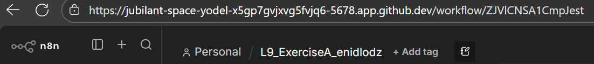

added code node with proper code
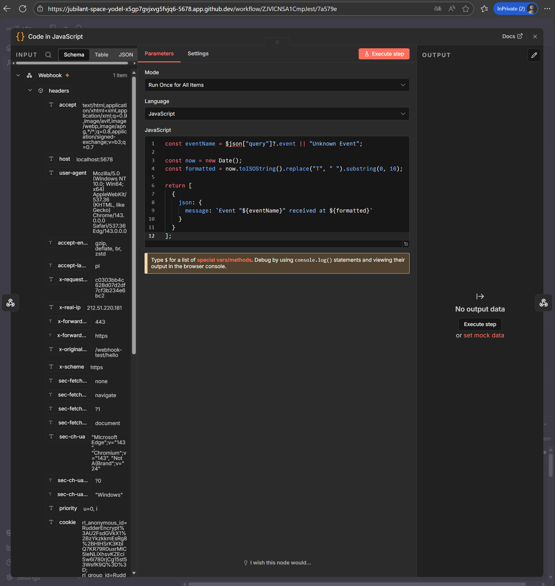 

response with HTML 200 OK in respond to webhook
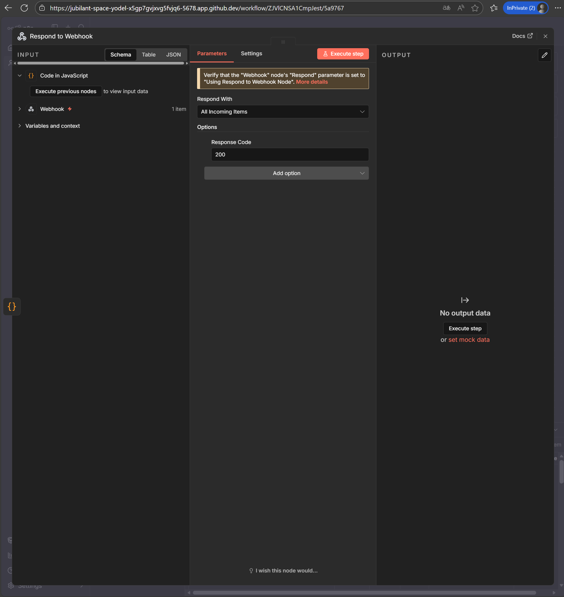 

lecture event parsed correctly with `webhook-test` in browser
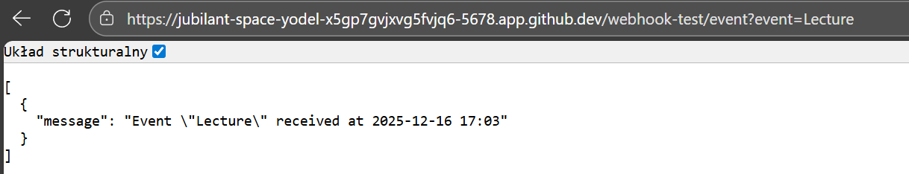

after publishing, `webhook` processes correctly (done here with `curl`)
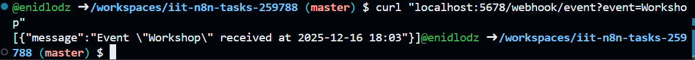

---
created with proper name
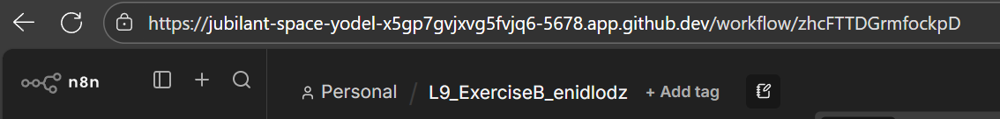

GET from API w/ JSON
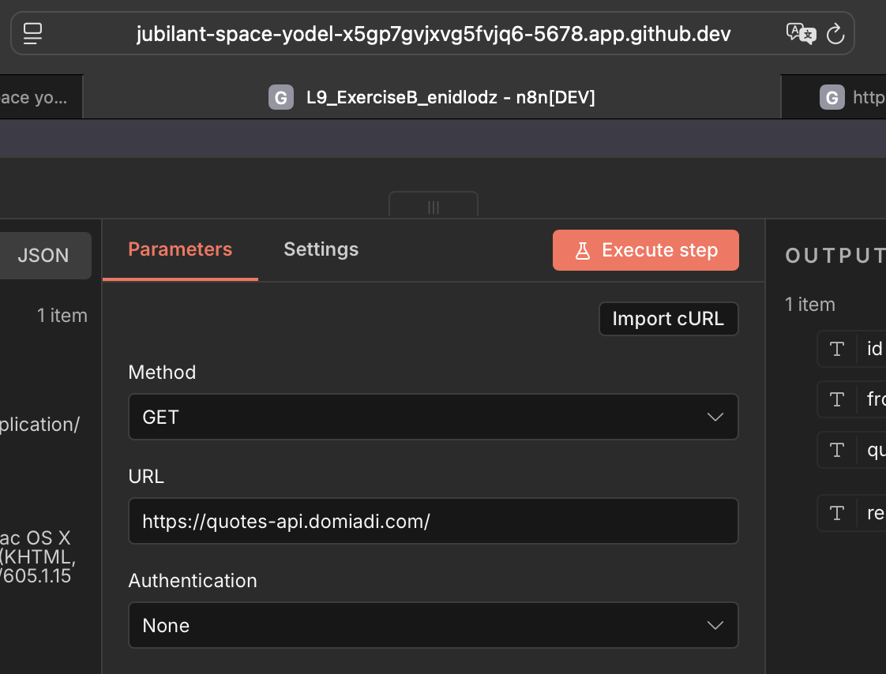

proper JSON response in respond to webhook
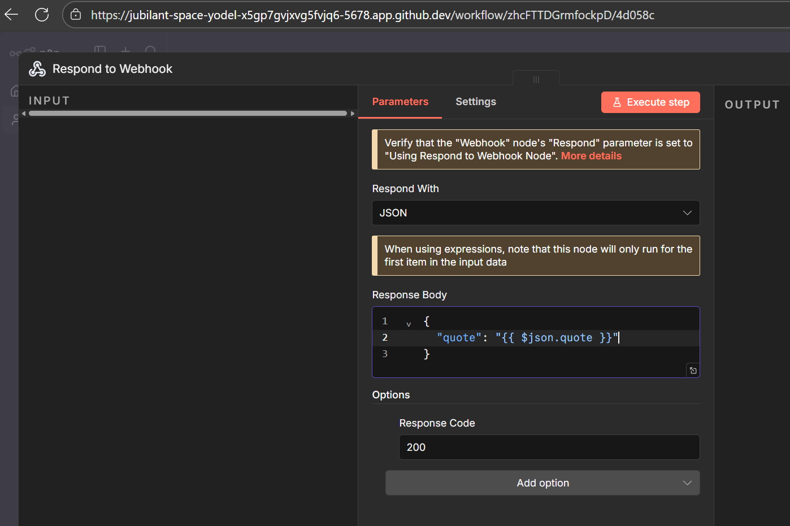 

API response in `webhook-test`
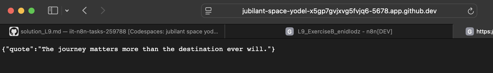

API response in published `webhook` (done with `curl`)
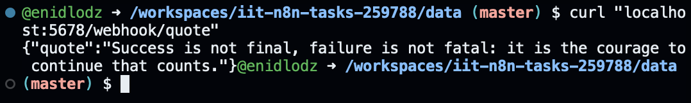

---

created with proper name
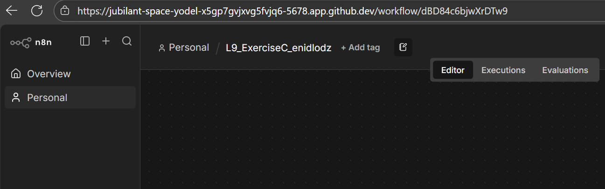

code in javascript node
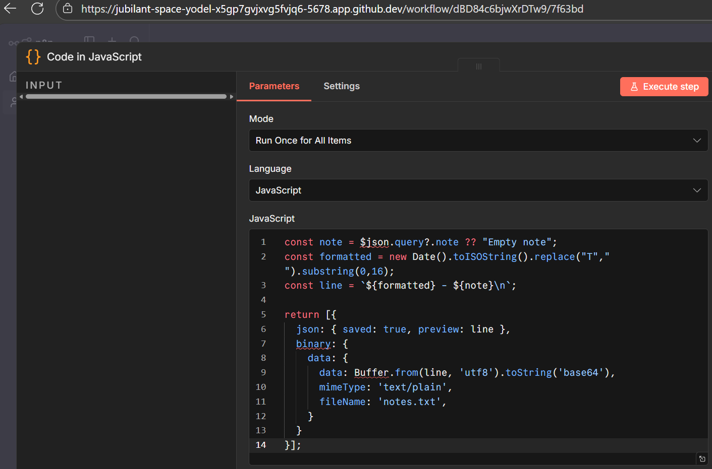

write file node as defined in exercise MD file
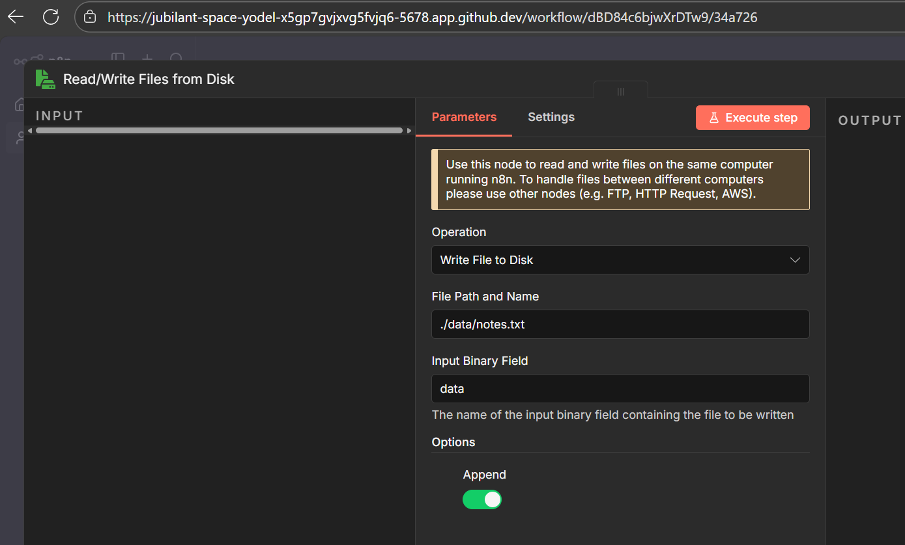

respond to webhook node
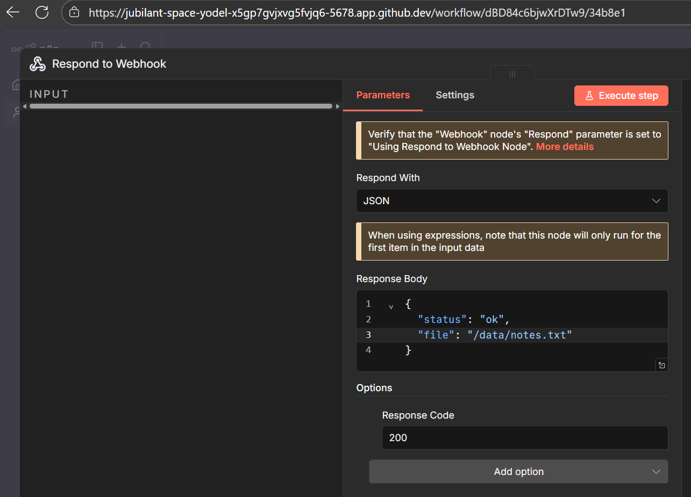

no matter if the `data` folder is owned by `$(whoami)`, nor if it has `drwxrwxrwx+` permissions, the file refuses to write. i've tried `/workspaces/iit-n8n-tasks-259788/data/notes.txt`, `~/data/notes.txt`, some combination of the two, to no avail. i've genuinely ran out of ideas.
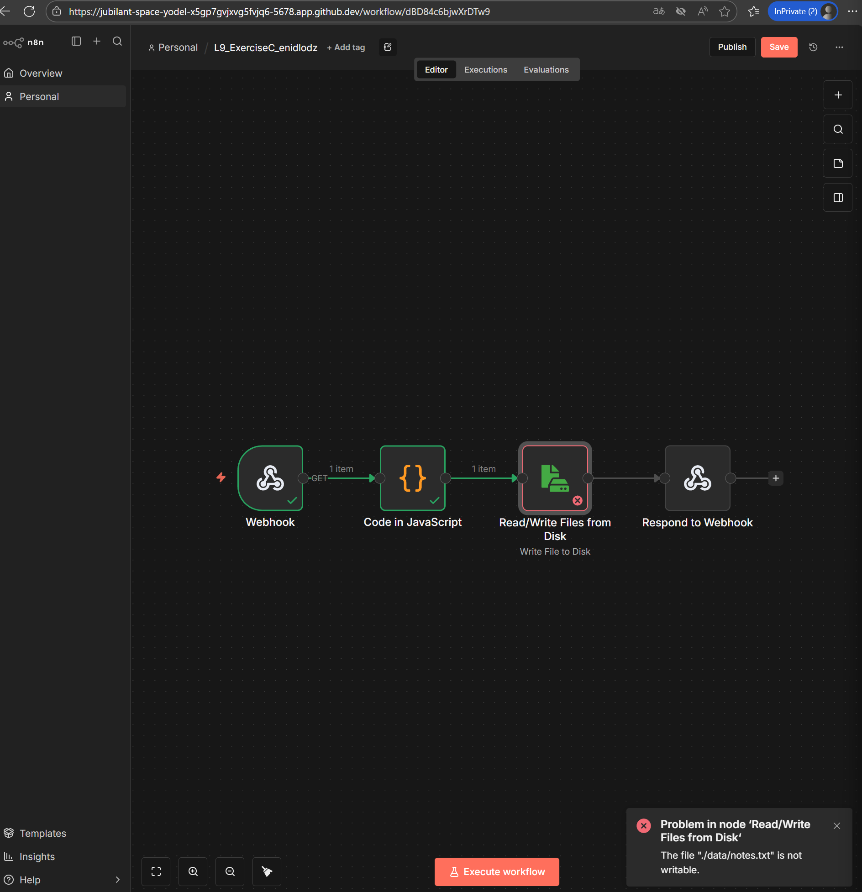